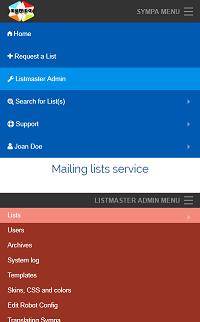
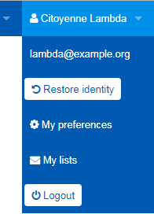

Web interface for listmaster
============================

Listmaster portal
-----------------

If you logged-in and you are a [listmaster](../customize/basics-roles.md),
you can move to listmaster portal page by choosing "Listmaster Admin" item on
the top menu bar.

Thus, you can perform following admninistrative operations.

### Lists

  - View Pending (Requested) lists

    If list creation requires approval by listmaster, the lists in pending
    status are listed on this page. Listmasters may either approve (open) or
    reject (delete) each list.

  - View Closed Lists

    The list owner or the listmaster may close the list, and closed lists are
    listed on this page. Listmasters may either restore (open) or purge
    (delete) each list.

  - View Lists sorted by Creation Date
  - View Lists sorted by Last Message Date

    Listmaster can view the all lists on these pages.

### Users

  - Search user

  - Show sessions

  - Change user's email

  - Impersonate another User

### Archives

  - Rebuild archives for an individual list

  - Rebuild archives for all lists

### System log

  - Set log level

### Templates

  - Edit default list template

  - Edit site-wide templates

  - Enable / disable dumping template Variables

### Cascading Style Sheet

By this page, you can choose colors for web interface using the color editor.
See "~~[Appearances](../customize/appearances.md)~~" for details.

### View domain config

By this page, you can edit parameters in site-wide configuration file
(`sympa.conf`) and in configuration specific to accessing mail domain
(`robot.conf`) using web interface.

> **Note**
>
>   * This page is read-only: Parameters can not be changed.
>     The feature to change config using web interface has not been
>     implemented yet.

List management page
--------------------

Listmaster can manage each list by accessing its management page.
The listmaster has privileges of
the [(privileged) list owner](../customize/basics-roles.md) on each list.

To know about operations on the list management page, see the documentation
for list owners and moderators.

Operating as another user
-------------------------

Using "``Impersonate another User``" function on "``Users``" page in listmaster
portal, the listmaster can operate as if they are another user.

To switch back to listmaster, use "``Restore identity``" button on top menu.

