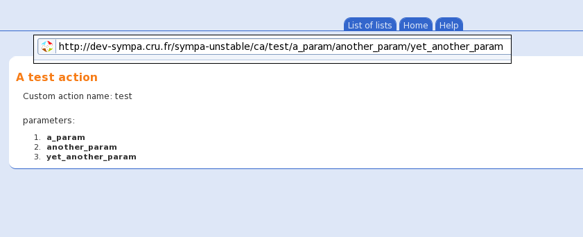

Custom actions for web interface
================================

Starting Sympa 6.1, you can create your own actions, i.e. you can display any [web template](basics-templates.md#mail-and-web-template-files) in the Sympa web interface. These templates will be processed and completely integrated to Sympa, using its CSS and the data from the server.

Custom actions are used to run specific code and/or display user defined templates. They can be executed in list or global context (it is up to you to decide what to do in both cases). Previously, a custom action was a simple TT2 template added to the web interface. It could only display data, not process them. They were improved to allow greater expressiveness.

----
Important:

  * After upgrading from Sympa prior to 6.2, any pre-exisitng custom actions
    must be moved to the relevant `custom_action` directory to keep working.

----

You can create a *your_action*`.pm` module under any of following directories:

  - [``$SYSCONFDIR``](../layout.md#sysconfdir)`/`*robot*`/custom_actions/`
  - [``$SYSCONFDIR``](../layout.md#sysconfdir)`/custom_actions/`

In list context you can also create it under:

  - [``$EXPLDIR``](../layout.md#expldir)`/`*list path*`/custom_actions/`

This module must:

  - define a package called *your_action*`_plugin`, and
  - have a single subroutine `process()` to add custom processing.

You can also create a *your_action*`.tt2` file at the same place to display your template. You don't need the `<head>` section or the `<body>` tag.

Your custom action is reachable using URL:

  - `http://`[*wwsympa_url*](../man/sympa.conf.5.md#wwsympa_url)`/ca/`*your_action*`/`*param1*`/`*param2*`/`*param3*`/...`
    in global context
  - `http://`[*wwsympa_url*](../man/sympa.conf.5.md#wwsympa_url)`/lca/`*your_action*`/`*listname*`/`*param1*`/`*param2*`/`*param3*`/...`
    in list context

*param1*, *param2* etc. are parameters that can be later used by the custom action.

The HTML code in *your_action*`.tt2` can make use of the parameters this way: `[%cap.1%]` for the first parameter (*param1* in the example URL above), `[%cap.2%]` for the second one, and so on. If the module is not defined, the template is simply displayed.

You can even have a robot-common *your_action*`.pm` module with a specific *your_action*`.tt2` for each robot as the file (`.pm` or `.tt2`) is conducted in this order :

  - [``$EXPLDIR``](../layout.md#expldir)`/`*list path*`/custom_actions/`
  - [``$SYSCONFDIR``](../layout.md#sysconfdir)`/`*robot*`/custom_actions/`
    (if robot support)
  - [``$SYSCONFDIR``](../layout.md#sysconfdir)`/custom_actions/`

The module's subroutine `process()` receives `@cap` entries as arguments (the List object is prepended to the argument list in list context). The value returned by `process()` can be either:

  - `1`: To parse and display the custom action related template.
  - *a global action name*: To display its template.
  - `ca:`*other_custom_action*: To parse and display another custom action related template - you can therefore do your own custom workflow inside Sympa.
  - A hash: Its entries will override `$param` ones, in case "`custom_action`" or "`next_action`" are present, they act as described above.

Example:

[``$SYSCONFDIR``](../layout.md#sysconfdir)`/custom_actions/foo.pm`:
``` perl
package foo_plugin;
 
sub process {
    my $arg = shift;

    # Show list info page if in list context.
    return 'info' if ref $arg eq 'Sympa::List';

    # Show bar custom action tt2 if first arg is "bar".
    return 'ca:bar' if $arg eq 'bar';

    # Show foo.tt2 (own template) after putting "John" under the key "name" in
    # $param.
    return {name => 'John'} if $arg eq 'barbar';

    # Same thing, but showing review page.
    return {name => 'John', next_action => 'review'} if $arg eq 'barbarbar';

    # Just showing own temlate (foo.tt2).
    return 1; 
}

1;
```

[``$SYSCONFDIR``](../layout.md#sysconfdir)`/custom_actions/foo.tt2`:
``` html4strict
<h2>A test action</h2>
[% IF list %]
<p>liste: [% list %]</p>
[% END %]
<p>Custom action name: [% custom_action %]</p>
<p>parameters:
<ol>
[% FOREACH param=cap %]
<li><b>[% param %]</b></li>
[% END%]
</ol>
</p>
```

Here is the result:



