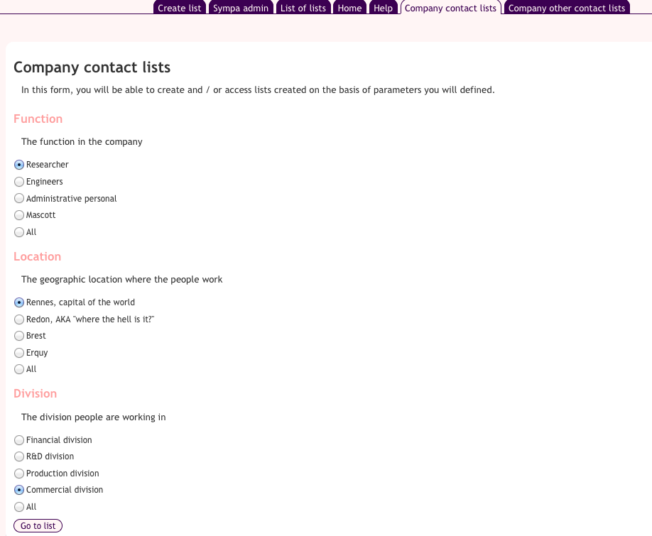
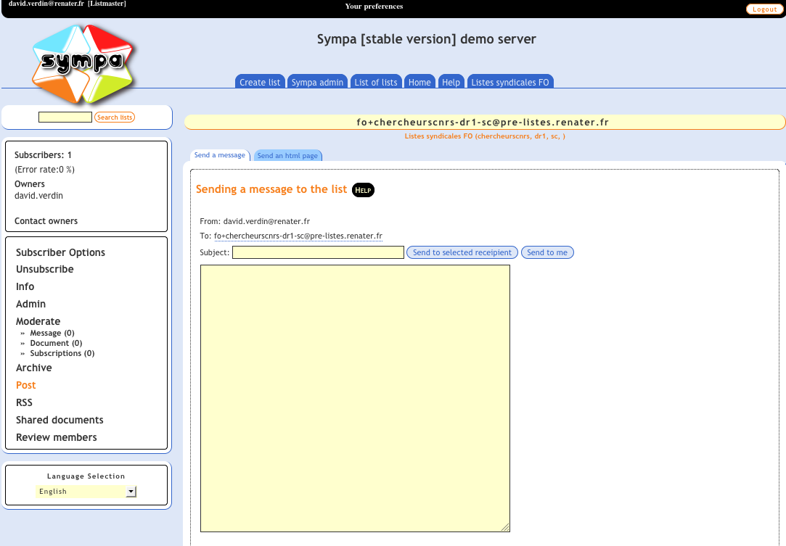
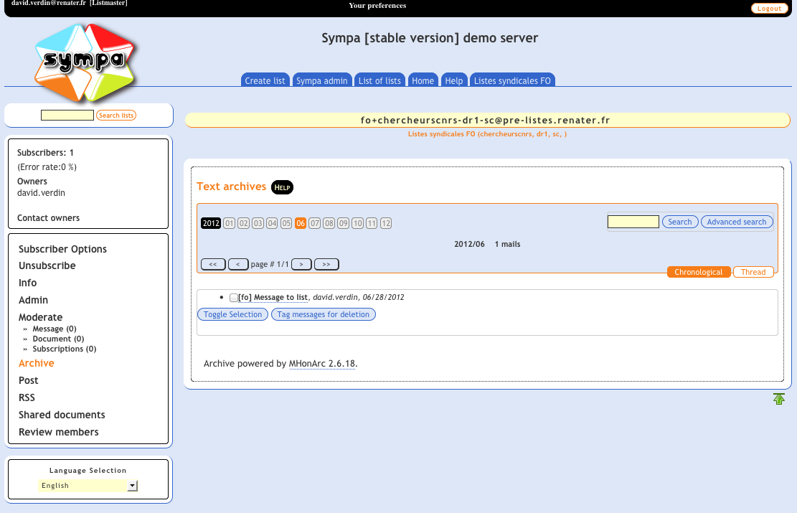
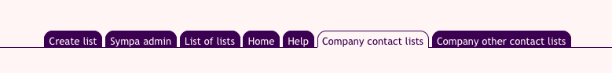

User-friendly automatic lists
=============================

----
Note:

  * This feature is available starting Sympa 6.1.12

----

While [automatic lists](automatic-lists.md) save a lot of efforts to listmasters, they still remain hard to use for users. Most of the difficulty resides in the proper constitution of a list name. For example, if you use three fields to build your lists names, users will need to know, in order to use an automatic list:

  - the prefix to tag the automatic lists
  - the order of the fields to use
  - the separator between each field value
  - the values each field can take and the semantics associated to each value.

Most users will never adopt this system as long as you have to manually compose the list email address. That's why most systems using automatic lists do it through a specialized user interface, using Thunderbird plugins or a dedicated web service.

The user-friendly automatic lists is there to let user create and find automatic lists using a point and click interface in the Sympa web GUI (though the classical approach - lists are created by a mail sending - still works).

Feature
-------

### Pseudo demo

Here are three screenshots describing the core functionnalities of the automatic lists in the Sympa web interface.

Once it is configured, users can select a new tab from the main Sympa tab panel. It displays a form. In this form, the user must select one value in each category. These categories describe the people the user wants to contact. The name of the automatic list created will be a concatenation of the values corresponding to the radio buttons selected.



Once the form is submitted, Sympa check whether the list exists already. If not, the list is created with the same mechanism described in the [automatic lists feature](automatic-lists.md). The user is then automatically redirected to the message composing space of the automatic list.



The list keeps existing after its creation. the user can therefore use its archives. Finding a list is just a matter of filling the first form and, once the message composing space is displayed, click on the "archives" link in the list menu.



Configuration
-------------

### `sympa.conf` configuration

To make the automatic lists available through the web interface, these families must be declared in sympa.conf (or robot.conf) using the `automatic_list_families` parameter.

The following values are expected for each family:

  - `name`: the name of the family to be used by Sympa. It is the actual family name (i.e. the name of the directory containing the family definition);
  - `display`: a short name used in the web interface
  - `prefix`: the prefix that will be used to tag the lists of this family (to be interpreted by the MTA to redirect messages to this list to the familyqueue program;
  - `prefix_separator`: the prefix that will be inserted between the prefix and the string composed from informations taken from the list creation form.
  - `classes_separator`: the character string that will separate each class value in the list name.
  - `family_owners_list`: the name of a list whose users will be allowed to create automatic lists if you use the `automatic_list_creation.family_owner` scenario.

In this doc, we suppose you have defined this parameter with the following value:

``` code
automatic_list_families    name=fo:prefix=fo:display=Company contact lists:prefix_separator=+:classes_separator=-:family_owners_list=fo@dev-sympa.cru.fr;name=cgt:prefix=cgt:display=Company other contact lists:prefix_separator=+:classes_separator=-:family_owners_list=cgt@dev-sympa.cru.fr
```

Also, to make the automatic lists creation form available, you must change the value of the `automatic_list_creation` parameter to `family_owner`. This is a default scenario provided by Sympa that will allow autoamtic list creation to the follwing users:

  - the listmasters
  - the subscribers to a list defined is sympa.conf `automatic_list_families` parameter for each family.

Here is the code of this scenario:

``` code
title.gettext Restricted to people subscribed to the list of family owners.

is_listmaster([sender])    smtp,dkim,md5,smime        ->    do_it
is_subscriber([family->family_owners_list],[sender])    smtp,dkim,md5,smime        ->    do_it
true()    smtp,dkim,md5,smime        ->    reject,quiet
```

Once you've done that, restart the web server. You should, as listmaster, see two new tabs in the main Sympa menu:



Clicking on one of thses tabs will redirect you to the automatic lists creation form which, if you are following this doc step by step, should still be empty as our automatic lists families are not created yet.

### Create families for automatic lists

To set up this functionnality, you need first to [create at least an automatic lists family](automatic-lists.md). You can define as many families as you wish.

A feature that can be usefull is the family unsubscription, if you wish.

On thing important when you create the config.tt2 of the families is the order in which the semantics of the data contained in the family name. If you want your lists name to look like "&lt;prefix&gt;+&lt;age&gt;-&lt;occupation&gt;@domaine.tld", you will need to make sure that in your config.tt2 you actually use the first item you find in the list name as the age and the second as the occupation. Otherwise, you're screwed.

This is a very important point to keep in mind when you create the `automatic_lists_description.conf` file in the section below: make sure that the order you define for each class will make them appear at the right place in the list name, according to what you defined in your config.tt2.

### Customize the list families to make them available online

To display a form for a family, you need to add a new file to the family folder: `automatic_lists_description.conf`. This file contains the description of the fields used to:

  - compose the list name,
  - extract the subscribers,
  - generally speaking, instantiate variables in the family tt2 files.

Here is a summary of the structure of this file:

``` code
[class
      name <short ascii name>
      stamp <A short description of the class>
      description <A user focused explanation of the semantics of the class>
  order <An integer>
      instances [order <An integer> --- value <short ascii value> --- tag <A human readable description of the value> (%%%)] (n times)
] (n times)
```

This file can contain only one type of parameter: `class`. A class defines a particular quality used to describe the population we want to subscribe to a list: Function, age class, location, etc. The class itself is described with several metadata:

  - `name`: The name used to describe this class internally. Its only use is to name the radio button fields in the list creation form.
  - `stamp`: A short name used to make a title in the lists creation form
  - `description`: A longer description of the class displayed below the title in the list creation form.
  - `order`: This field contain an integer. It corresponds to the position this class will have intht e list creation form AND the position in which it will be used in the list name. I'll repeat just to make it clear: **The order of a class corresponds to the position this class will have in the list name**. It must then be chosen carefully and definitively **before** you put the automatic lists in production. If you change this order, the users won't be able to retrieve the lists created prior to the order change.
  - `instances`: The instances are the values a class can actually take. These values are all defined in this field in the form of a character string<sup><a href="#fn__1" name="fnt__1" id="fnt__1" class="fn_top">1)</a></sup>. The string must be structured as follows:
      - each instance is defined by a string of the form: order &lt;An integer&gt; — value &lt;short ascii value&gt; — tag &lt;A human readable description of the value&gt;, where:
          - `order` is followed by an integer. This integer only defined the position this value will hold in the lists creation form. It has no other usage.
          - `value` is the actual value of the instance, the one that will be used in the list name. It must then only contain sequences compatible with the local part of an email address as defined by the RFC 822.
          - `tag` is a short text that will be displayed in the character form in lieu of the actual instance value.
      - The isntances are separated by the "%%%" character string.

Here is an example of `automatic_lists_description.conf`, with three classes, each one having four possible instances and a fifth one including each possible values of the instances:

``` code
class
    name function
    stamp Function
    description The function in the company
    order 0
    instances order 0 --- value researcher --- tag Researcher %%% order 1 --- value engineer --- tag Engineers %%% order 2 --- value administrative --- tag Administrative personal %%% order 3 --- value mascott --- tag Mascott %%% order 4 --- value all --- tag All

class
    name location
    stamp Location
    description The geographic location where the people work
    order 1
    instances order 0 --- value rennes --- tag Rennes, capital of the world %%% order 1 --- value redon --- tag Redon, AKA "where the hell is it?" %%% order 2 --- value brest --- tag Brest %%% order 3 --- value erquy --- tag Erquy %%% order 4 --- value all --- tag All

class
    name division
    stamp Division
    description The division people are working in
    order 2
    instances order 0 --- value financial --- tag Financial division %%% order 1 --- value research --- tag R&D division %%% order 2 --- value production --- tag Production division %%% order 3 --- value bastards --- tag Commercial division --- default 1 %%% order 4 --- value all --- tag All
```

Here is the form that would be displayed by this version of `automatic_lists_description.conf`:


If you submit this form, using the exact configuration given as example in this doc, you will create a list called `fo+researcher-rennes-bastards@domain.tld`.

<sup><a href="#fnt__1" id="fn__1" name="fn__1" class="fn_bot">1)</a></sup> It should be described as a hierarchical structure instead but Sympa can't handle configurations with more than one level of hierarchy. So this character string is a short term solution to make the feature available anyway.
