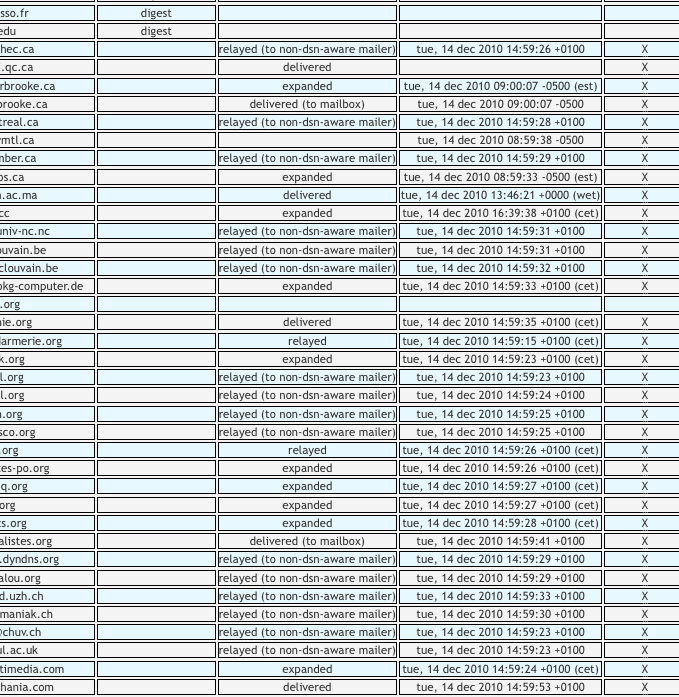

Message tracking
================

List owner can verify message delivery and disposition for each message using a special feature that can configutred for a robot or a list.

If the list is configured for tracking, outgoing messages include a "delivery status notification" request and optionnaly a "message disposition notification" request. This allows list owner to verify for **each mail** who did not received the message but also who received it and who displayed it.

Notification (both positive status and negative status are stored and can be used later to prove that a message was delivered or displayed by its recipient.

When active tracking overright VERP parameter to 100%. Of course, tracking may be expensive.

Two different modes can be used for tracking :

  - DSN:

    Sympa will just require **D**elivery **S**tatus **N**otification . This is a ESMTP service that will not be viewed by recipients. This service may or may not be implemented by remote MTAs.

  - MDN:

    In that case Sympa will require both DSN and **M**essage **D**isposition **N**otification. This service is usually prompted to recipient that may accept to send back a delivery or not. Because this may be surprising for subscribers and also because this may be used by spammers we suggest you not to use this feature unless subscribers are informed previously.

Tracking feature is accessible in archive web page when list owner display a message where tracking was actived. It require to support VERP so a plussed aliases is needed.

The following screen copy is a part of the tracking information of one message from a list archive. Email address are hidden in this image for privacy reason.



Setup
-----

  * Mail alias for VERP delivery have to work.  See
    "[Bounce management](../customize/bounce-management.md)".

  * Edit [``sympa.conf``](../layout.md#config) to add both or one of following
    lines:
    ``` code
    tracking_delivery_status_notification on
    tracking_message_disposition_notification on 
    ```
    These settings can be overridden by configuration of each list: See
    [list tracking configuration parameters](/gpldoc/man/sympa_config.5.html#tracking).

    > **Note**
    >
    >   * The parameters above can not be overridden by `robot.conf`.

Acknowledgements
----------------

This feature was added in version 6.2. It's a contribution from french army "DGA Maitrise de l'Information".

